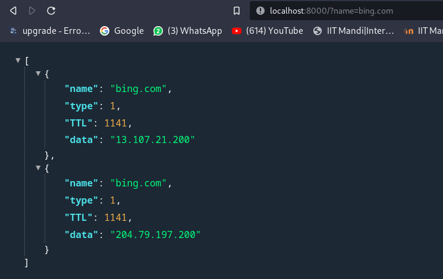

# How to Use
## Run the following command to start the DoH server in a container

```sh 
docker compose up -d
```

### Example for resolving bing.com



<h3>It uses cloudflare servers to resolve the DNS request over port 443</h3>